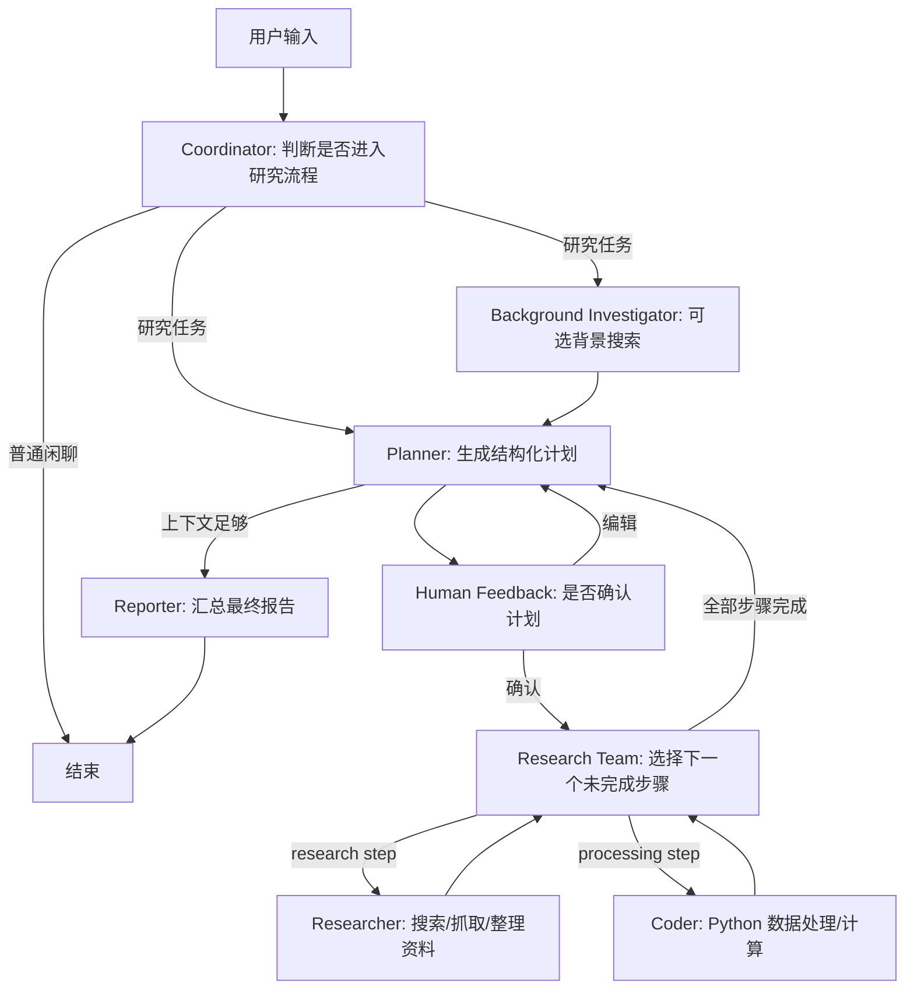

# deepAgent 复现 deer-go 实现指南

本文档的目标不是逐行复制 `deer-go`，而是帮助你理解它为什么这样设计，并按可验证的小步骤实现自己的 `deepAgent`。

参考项目路径：

```text
/Users/gd-npc-1029/Documents/CodeBase/eino-examples/flow/agent/deer-go
```

你的项目路径：

```text
/Users/gd-npc-1029/Documents/CodeBase/deepAgent
```

## 1. 先理解 deer-go 在做什么

`deer-go` 是一个基于 CloudWeGo Eino 的多 Agent 深度研究工作流。它把一次用户请求拆成几个角色协作：



核心思想：

- 全局只有一份 `State`，所有节点读取和修改它。
- 每个节点都是一个小图：`load prompt -> model/agent -> router`。
- 路由不靠复杂的 if-else 集中控制，而是每个节点写入 `state.Goto`，总图读取 `Goto` 决定下一跳。
- Planner 输出结构化 JSON `Plan`，Researcher/Coder 逐个填充 `Step.ExecutionRes`，Reporter 只基于这些结果写报告。
- Console 和 HTTP SSE 共享同一张 Graph，只是输入输出方式不同。

## 2. deer-go 的关键文件地图

先按这个顺序读参考项目：

```text
main.go                         # console/server 两种启动方式
biz/model/state.go              # 全局 State 和 checkpoint
biz/model/planner.go            # Plan / Step 数据结构
biz/eino/builder.go             # 总图编排
biz/eino/coordinator.go         # 任务分流
biz/eino/planner.go             # 生成研究计划
biz/eino/research_team.go       # 找到下一个未完成 step
biz/eino/researcher.go          # ReAct + MCP 搜索工具
biz/eino/coder.go               # ReAct + Python MCP
biz/eino/reporter.go            # 汇总报告
biz/eino/human_feedback.go      # 人类确认/编辑计划
biz/infra/llms.go               # ChatModel / PlanModel 初始化
biz/infra/mcp.go                # MCP client 初始化
biz/infra/template.go           # prompt 模板加载
biz/infra/logger.go             # console/SSE 流式输出 callback
biz/handler/deer.go             # HTTP SSE 接口
conf/config.go                  # YAML 配置加载
biz/prompts/*.md                # 各 Agent 的角色和输出约束
```

## 3. deepAgent 建议目录结构

你现在的项目已有 `main.go`、`conf/`、`README.md`。后续建议扩展为：

```text
deepAgent/
  main.go
  run.sh
  go.mod
  conf/
    config.go
    deep-agent.yaml.example
    deep-agent.yaml
  internal/
    consts/
      consts.go
    model/
      state.go
      plan.go
      server.go
    infra/
      llm.go
      mcp.go
      prompt.go
      callback.go
    agent/
      builder.go
      coordinator.go
      planner.go
      research_team.go
      researcher.go
      coder.go
      reporter.go
      human_feedback.go
  internal/prompts/
    coordinator.md
    planner.md
    researcher.md
    coder.md
    reporter.md
  mcps/python/
    server.py
    pyproject.toml
  docs/
    rebuild-deer-go-guide.md
```

如果你想先学清楚核心工作流，可以暂时不做 HTTP server，把 `handler` 和 SSE 放到最后。

## 4. 分阶段复现路线

### 阶段 0：建立最小工程地基

目的：项目能读配置、初始化模型、从命令行接收一个用户问题。

实现文件：

```text
conf/config.go
main.go
run.sh
```

要做的事：

1. 在 `conf/config.go` 中实现 `Load(ctx)`。
2. 从 `conf/deep-agent.yaml` 读取：
   - `model.default_model`
   - `model.api_key`
   - `model.base_url`
   - `setting.max_step_num`
   - 后续再加 `setting.max_plan_iterations`
3. 在 `main.go` 中：
   - 加载配置
   - 初始化模型
   - 读取 console 输入
   - 先直接调用一个普通 chat model 返回结果

验收标准：

```bash
cp conf/deep-agent.yaml.example conf/deep-agent.yaml
./run.sh
```

输入一个问题后，模型能正常返回文本。

注意点：

- `deer-go` 的配置读取依赖当前工作目录，所以运行命令必须在项目根目录。
- 你也可以改成基于可执行文件路径或环境变量，但第一版建议保持简单。

### 阶段 1：定义全局状态和计划模型

目的：让所有 Agent 通过同一个状态对象协作。

实现文件：

```text
internal/model/state.go
internal/model/plan.go
internal/consts/consts.go
```

建议先实现这些字段：

```go
type State struct {
    Messages []*schema.Message `json:"messages,omitempty"`

    Goto        string `json:"goto,omitempty"`
    Locale      string `json:"locale,omitempty"`
    CurrentPlan *Plan  `json:"current_plan,omitempty"`

    PlanIterations     int  `json:"plan_iterations,omitempty"`
    MaxPlanIterations  int  `json:"max_plan_iterations,omitempty"`
    MaxStepNum         int  `json:"max_step_num,omitempty"`
    AutoAcceptedPlan   bool `json:"auto_accepted_plan,omitempty"`
    InterruptFeedback  string `json:"interrupt_feedback,omitempty"`
}
```

计划模型：

```go
type StepType string

const (
    Research   StepType = "research"
    Processing StepType = "processing"
)

type Step struct {
    NeedWebSearch bool     `json:"need_web_search"`
    Title         string   `json:"title"`
    Description   string   `json:"description"`
    StepType      StepType `json:"step_type"`
    ExecutionRes  *string  `json:"execution_res,omitempty"`
}

type Plan struct {
    Locale           string `json:"locale"`
    HasEnoughContext bool   `json:"has_enough_context"`
    Thought          string `json:"thought"`
    Title            string `json:"title"`
    Steps            []Step `json:"steps"`
}
```

常量：

```go
const (
    Coordinator  = "coordinator"
    Planner      = "planner"
    ResearchTeam = "research_team"
    Researcher   = "researcher"
    Coder        = "coder"
    Reporter     = "reporter"
    Human        = "human_feedback"
)
```

验收标准：

- 能编译。
- 给 `State` 写一个简单单测：JSON marshal/unmarshal 后字段不丢失。

### 阶段 2：实现 prompt 加载和模型初始化

目的：把 Agent 的角色约束从 Go 代码中分离出来。

实现文件：

```text
internal/infra/prompt.go
internal/infra/llm.go
internal/prompts/*.md
```

`prompt.go` 做一件事：

- 按名称读取 `internal/prompts/{name}.md`。

`llm.go` 做两件事：

1. 初始化普通 `ChatModel`。
2. 初始化 `PlanModel`，给它设置 JSON schema response format，让 planner 更稳定地产出 `Plan`。

参考 `deer-go`：

- 普通模型：`infra.ChatModel`
- 计划模型：`infra.PlanModel`
- `PlanModel` 使用 `jsonschema.Reflect(&model.Plan{})` 构造 schema。

验收标准：

- 能调用 `ChatModel.Generate`。
- 能调用 `PlanModel.Generate`，并尝试把输出反序列化为 `Plan`。

### 阶段 3：实现最小 Graph：Coordinator -> Planner -> Reporter

目的：先跑通 Eino Graph 的控制流，不急着接 MCP 工具。

实现文件：

```text
internal/agent/builder.go
internal/agent/coordinator.go
internal/agent/planner.go
internal/agent/reporter.go
```

第一版流程：

```text
START -> Coordinator -> Planner -> Reporter -> END
```

可以先简化：

- Coordinator 不使用 tool call，直接把 `state.Goto = Planner`。
- Planner 生成 `Plan`，写入 `state.CurrentPlan`。
- Reporter 根据 `state.CurrentPlan` 写一份最终报告。

等这个闭环跑通后，再恢复 deer-go 的真实设计：

- Coordinator 绑定 `hand_to_planner` 工具。
- 如果模型调用该工具，则进入 Planner。
- 如果只是闲聊，则直接 END。

实现要点：

1. 每个节点内部建一个小图：

```text
START -> load -> agent -> router -> END
```

2. `load` 负责读取 State 和 prompt，构造 `[]*schema.Message`。
3. `agent` 调用模型。
4. `router` 解析模型输出，并写 `state.Goto`。
5. 总图通过统一的 `agentHandOff` 读取 `state.Goto`。

验收标准：

- Console 输入一个研究问题。
- 日志或输出中能看到 planner 生成计划。
- reporter 能基于计划输出最终内容。

### 阶段 4：实现 ResearchTeam 调度器

目的：从“生成计划后直接报告”升级为“逐步执行计划”。

实现文件：

```text
internal/agent/research_team.go
```

核心逻辑：

```text
遍历 state.CurrentPlan.Steps
  找第一个 ExecutionRes == nil 的 step
    step_type == research   -> state.Goto = Researcher
    step_type == processing -> state.Goto = Coder
  如果没有未完成 step
    如果还没达到最大计划轮次 -> state.Goto = Planner
    否则 -> state.Goto = Reporter
```

为什么执行完后回 Planner？

- 因为第一轮资料可能不足。
- Planner 可以基于已有执行结果判断 `has_enough_context`。
- 如果还不够，可以继续规划下一轮。

第一版可以简化：

- 所有 step 执行完就直接 Reporter。
- 等 Researcher/Coder 稳定后，再加入多轮 Planner。

验收标准：

- 构造一个含两个 step 的 `Plan`。
- ResearchTeam 每次只分发一个未完成 step。
- step 全部完成后进入 Reporter。

### 阶段 5：实现 Researcher，不接真实搜索也能先跑

目的：完成研究型 step 的执行结果写回。

实现文件：

```text
internal/agent/researcher.go
internal/prompts/researcher.md
```

最小版：

- 从 `state.CurrentPlan.Steps` 找第一个未完成 step。
- 把 step 的 title/description 拼进 prompt。
- 先用普通 ChatModel 生成一段“研究结果”。
- 把输出写回 `step.ExecutionRes`。
- `state.Goto = ResearchTeam`。

进阶版：

- 初始化 MCP client。
- 通过 `mcp.GetTools` 获取搜索、抓取等工具。
- 使用 Eino `react.NewAgent`，把工具注入 `ToolsConfig`。
- 让 Researcher 通过 ReAct 自动调用搜索工具。

验收标准：

- Researcher 能填充当前 step 的 `ExecutionRes`。
- 执行完后回到 ResearchTeam。
- 多个 research step 能依次执行。

### 阶段 6：实现 Coder 和 Python MCP

目的：把数据处理、计算、脚本执行类任务交给 Python 工具。

实现文件：

```text
internal/agent/coder.go
mcps/python/server.py
mcps/python/pyproject.toml
```

最小版：

- Coder 先不用 Python MCP，只用 ChatModel 生成处理结论。

进阶版：

- 复用参考项目的 Python MCP 思路：
  - `execute_python`
  - `list_variables`
  - `install_package`
- 在 Coder 中只加载名称以 `python` 开头的 MCP server。
- 使用 `react.NewAgent`，把 Python 工具传给 Coder。

注意点：

- Python MCP 会执行代码，开发阶段只在本地可信环境使用。
- 第一版不要允许用户随意通过 HTTP 暴露这个能力。

验收标准：

- Planner 生成 `processing` step。
- Coder 能执行并写回 `ExecutionRes`。
- Reporter 能引用 Coder 的结果。

### 阶段 7：实现 Human Feedback 和 Checkpoint

目的：支持“计划出来后先停一下，用户确认后继续执行”。

实现文件：

```text
internal/agent/human_feedback.go
internal/model/state.go
```

核心机制：

- Human 节点读取 `state.AutoAcceptedPlan`。
- 如果自动接受，直接进入 ResearchTeam。
- 如果不是自动接受：
  - `InterruptFeedback == accepted`：进入 ResearchTeam。
  - `InterruptFeedback == edit_plan`：回 Planner。
  - 其他情况：返回 `compose.InterruptAndRerun`。

Checkpoint 的作用：

- Graph 中断后保存当前 State。
- 用户确认计划后，用相同 `thread_id` 继续从 checkpoint 恢复。

最小实现：

- 先用 `map[string][]byte` 做内存 checkpoint。
- 后续再替换为 Redis、DB 或文件存储。

验收标准：

- 非自动接受时，Planner 后会中断。
- 传入 `accepted` 后能从原计划继续执行。
- 传入 `edit_plan` 后能带着用户补充意见重新规划。

### 阶段 8：实现 HTTP SSE 接口

目的：让前端可以像 deer-flow 前端一样消费流式事件。

实现文件：

```text
internal/model/server.go
internal/infra/callback.go
internal/handler/chat.go
router.go 或 main.go
```

请求结构参考：

```go
type ChatRequest struct {
    Messages          []*schema.Message `json:"messages,omitempty"`
    ThreadID          string            `json:"thread_id,omitempty"`
    MaxPlanIterations int               `json:"max_plan_iterations,omitempty"`
    MaxStepNum        int               `json:"max_step_num,omitempty"`
    AutoAcceptedPlan  bool              `json:"auto_accepted_plan,omitempty"`
    InterruptFeedback string            `json:"interrupt_feedback,omitempty"`
}
```

SSE 事件建议兼容 deer-go：

```text
message_chunk
tool_calls
tool_call_chunks
tool_call_result
interrupt
```

回调层职责：

- 监听 Eino stream callback。
- 把 `schema.Message` 转成前端事件。
- 如果是 tool call，输出工具调用事件。
- 如果是普通文本，输出 message chunk。

验收标准：

- `POST /api/chat/stream` 能返回 `text/event-stream`。
- 前端能收到 token/message chunk。
- human feedback 时能收到 `interrupt` 事件。

### 阶段 9：补充 Background Investigator

目的：在正式规划前先做一次快速背景搜索，提高 Planner 的上下文质量。

实现文件：

```text
internal/agent/background_investigator.go
```

核心逻辑：

- 从 MCP 工具中找一个名字以 `search` 结尾的工具。
- 用用户最后一条消息作为 query。
- 把搜索结果写入 `state.BackgroundInvestigationResults`。
- `state.Goto = Planner`。

Planner 加载 prompt 时，如果有背景调查结果，就把它追加进输入消息。

验收标准：

- 开启背景调查时，Coordinator 后先进入 Background Investigator。
- Planner 的输入包含背景搜索结果。
- 关闭时直接进入 Planner。

## 5. 推荐实现顺序清单

按这个顺序做，每一步都保持可运行：

```text
[ ] 0. 配置读取 + console 输入 + 普通模型调用
[ ] 1. State / Plan / consts
[ ] 2. prompt 加载 + ChatModel / PlanModel
[ ] 3. Eino Graph 最小闭环：Coordinator -> Planner -> Reporter
[ ] 4. ResearchTeam 调度未完成 step
[ ] 5. Researcher 填充 research step
[ ] 6. Coder 填充 processing step
[ ] 7. MCP client 初始化
[ ] 8. Researcher 接搜索/抓取 MCP
[ ] 9. Coder 接 Python MCP
[ ] 10. Human feedback + checkpoint
[ ] 11. HTTP SSE 接口
[ ] 12. Background investigator
[ ] 13. 日志、trace、错误处理、测试
```

## 6. 关键设计点解释

### 6.1 为什么使用 State.Goto

`State.Goto` 是整个系统的轻量路由协议。每个节点完成自己的工作后，不直接调用下一个节点，而是写：

```go
state.Goto = consts.ResearchTeam
```

总图中的 branch 函数统一读取：

```go
func agentHandOff(ctx context.Context, input string) (string, error) {
    var next string
    _ = compose.ProcessState[*model.State](ctx, func(ctx context.Context, state *model.State) error {
        next = state.Goto
        return nil
    })
    return next, nil
}
```

好处：

- 节点之间低耦合。
- 新增 Agent 时，只需要注册节点和常量。
- 调试时看 State 就能知道系统下一步要去哪。

### 6.2 为什么 Planner 要输出 JSON

Planner 是后续执行的契约。如果它输出自然语言，ResearchTeam 很难可靠判断：

- 有几个步骤？
- 哪些步骤需要搜索？
- 哪些步骤需要代码处理？
- 哪个步骤已经完成？

所以 Planner 必须输出 `Plan` JSON。`PlanModel` 最好使用 JSON schema response format 约束输出。

### 6.3 为什么 Researcher/Coder 都回到 ResearchTeam

Researcher 和 Coder 只关心当前 step，不负责全局调度。执行完成后统一回 ResearchTeam，由 ResearchTeam 决定：

- 继续下一个 step；
- 回 Planner 进行下一轮规划；
- 或进入 Reporter。

这样职责更干净。

### 6.4 为什么 Reporter 不自己搜索

Reporter 的定位是“基于已收集资料写报告”。它不应该再引入新的事实来源，否则会破坏可追踪性。最终报告应当只依赖：

- 用户原始需求；
- Planner 的任务描述；
- Researcher/Coder 的执行结果；
- 每个 step 记录的引用来源。

## 7. 每个 Agent 的输入输出契约

| Agent | 输入 | 输出 | 修改 State | 下一跳 |
|---|---|---|---|---|
| Coordinator | 用户原始消息 | 闲聊回复或 tool call | `Locale`, `Goto` | Planner / Background / END |
| Background Investigator | 用户最后一条消息 | 搜索结果 | `BackgroundInvestigationResults` | Planner |
| Planner | 用户消息、背景调查、已有结果 | `Plan` JSON | `CurrentPlan`, `PlanIterations` | Human / ResearchTeam / Reporter |
| Human Feedback | 用户确认或编辑意见 | 中断或继续 | `InterruptFeedback` | ResearchTeam / Planner |
| ResearchTeam | `CurrentPlan.Steps` | 无模型输出 | `Goto` | Researcher / Coder / Planner / Reporter |
| Researcher | 当前 research step | 研究结果 markdown | `Step.ExecutionRes` | ResearchTeam |
| Coder | 当前 processing step | 计算/处理结果 | `Step.ExecutionRes` | ResearchTeam |
| Reporter | 完整 Plan 和 step 结果 | 最终报告 | `Goto = END` | END |

## 8. deepAgent 第一版建议先做的简化

为了更快掌握主线，第一版可以有意识地少做几件事：

- 不接 HTTP，只做 console。
- 不做 human feedback，默认 `AutoAcceptedPlan = true`。
- 不做 background investigation。
- Researcher/Coder 先不用 MCP，只用普通模型生成结果。
- Plan 只允许最多 3 个 step。

第一版目标：

```text
用户输入
  -> Planner 生成 Plan
  -> ResearchTeam 分发 step
  -> Researcher/Coder 填 step 结果
  -> Reporter 输出最终报告
```

等这个闭环稳定后，再逐步补：

```text
Coordinator tool call
MCP 工具
Human feedback
HTTP SSE
Checkpoint
观测与 trace
```

## 9. 建议测试策略

先写低成本测试，不要等系统全接起来再测。

### Model 层

- `State` JSON 序列化/反序列化。
- `Plan` JSON 反序列化样例。
- step 执行结果写回。

### Agent 路由层

- Planner 输出 `has_enough_context=true` 时进入 Reporter。
- Planner 输出 `has_enough_context=false` 时进入 Human 或 ResearchTeam。
- ResearchTeam 找到第一个未完成 step。
- 所有 step 完成后进入 Reporter。

### Infra 层

- 配置文件缺失时返回明确错误。
- prompt 文件缺失时返回明确错误。
- MCP 初始化失败时能指出哪个 server 失败。

### 集成层

- Console 跑一个固定问题。
- 使用 mock model 固定返回 Plan，避免测试依赖真实 LLM。
- 后续 HTTP SSE 用 curl 验证事件格式。

## 10. 常见坑

### Planner 输出不是合法 JSON

处理方式：

- 给 `PlanModel` 加 JSON schema response format。
- prompt 中明确“只输出 JSON，不要 markdown code fence”。
- 解析失败时记录原始内容。
- 可以在开发期加一个清洗函数去掉 ```json，但不要依赖它作为核心策略。

### Graph 卡在某个节点

排查：

- 每个 router 都打印 `state.Goto`。
- 检查 builder 的 `outMap` 是否包含这个节点名。
- 检查有没有忘记 `g.AddBranch(node, ...)`。
- 检查节点内部是否把 `Goto` 设成了空字符串。

### MCP 初始化卡住

排查：

- 先单独运行 MCP server。
- Python MCP 先执行 `uv sync`。
- stdio MCP 的 command/args 必须在终端中能直接跑通。
- 第一次开发可以先跳过 MCP，避免把 Graph 问题和工具问题混在一起。

### Reporter panic

常见原因：

- 某个 step 的 `ExecutionRes == nil`，Reporter 直接解引用。
- 进入 Reporter 前先确认所有 step 完成。
- 或 Reporter 中对 nil 做保护，输出“该步骤未完成”。

### Human feedback 无法继续

排查：

- 前后两次请求的 `thread_id` 是否一致。
- 是否设置了 `compose.WithCheckPointID(thread_id)`。
- 是否注册了 `CheckPointStore`。
- `InterruptFeedback` 是否写入 State。

## 11. 每阶段提交建议

如果你后续使用 git，可以按这些提交点推进：

```text
feat: load config and run console chat
feat: add state and plan models
feat: initialize eino chat and plan models
feat: build minimal planner reporter graph
feat: add research team step scheduler
feat: add researcher and coder nodes
feat: wire mcp clients and python tool server
feat: add human feedback checkpoint flow
feat: expose chat stream sse endpoint
```

## 12. 最终目标行为

最终 `deepAgent` 应该能完成这条链路：

1. 用户提交一个复杂问题。
2. Coordinator 判断它需要研究。
3. Planner 输出结构化计划。
4. 用户确认或编辑计划。
5. ResearchTeam 逐个分发步骤。
6. Researcher 搜索并整理资料。
7. Coder 做计算、数据处理或 Python 分析。
8. Planner 判断上下文是否足够。
9. Reporter 输出一份结构化、带引用、可阅读的最终报告。

你每实现一个阶段，都应该能独立运行并看见系统状态如何变化。这样复现的过程会从“照着抄”变成“亲手把系统拼起来”。
